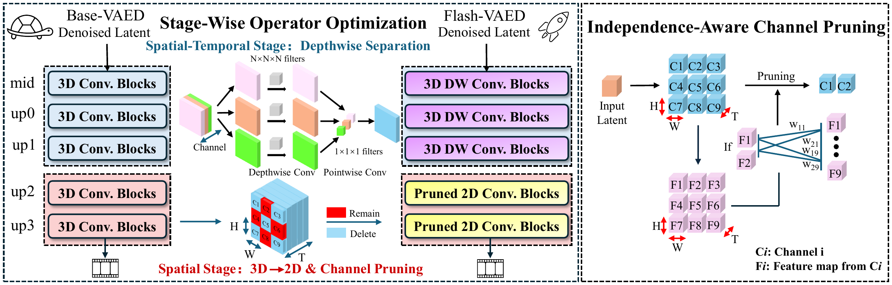
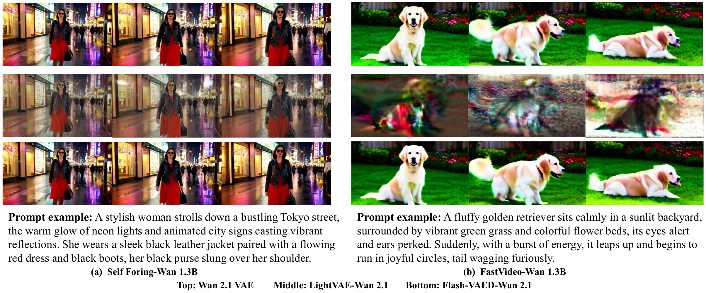

# Flash-VAED: Plug-and-Play VAE Decoders for Efficient Video Generation

[](https://arxiv.org/abs/2602.19161)
[](https://github.com/Aoko955/Flash-VAED)
[](https://huggingface.co/Aoko955/Flash-VAED)
[](https://icml.cc/)

[Lunjie Zhu](https://scholar.google.com/citations?user=ZnKjHG0AAAAJ&hl=zh-CN)<sup>1</sup>,
[Yushi Huang](https://harahan.github.io/)<sup>1</sup>,
[Xingtong Ge](https://xingtongge.github.io/)<sup>1</sup>,
[Yufei Xue](https://yufeixue.tech/)<sup>1</sup>,
[Zhening Liu](https://www.liuzhening.top/)<sup>1</sup>,
[Yumeng Zhang](https://scholar.google.com/citations?user=ueArr5YAAAAJ&hl=en)<sup>1</sup>,
[Zehong Lin](https://zhlinup.github.io/)<sup>2</sup>,
[Jun Zhang](https://eejzhang.people.ust.hk/)<sup>1</sup>\*

<sup>1</sup>iComAI Lab, The Hong Kong University of Science and Technology &nbsp;&nbsp;
<sup>2</sup>School of Data Science, Lingnan University

The Forty-Third International Conference on Machine Learning (**ICML**), 2026

[[Paper](https://arxiv.org/abs/2602.19161)]
[[Code](https://github.com/Aoko955/Flash-VAED)]
[[Model](https://huggingface.co/Aoko955/Flash-VAED)]

\* Corresponding author: [eejzhang@ust.hk](mailto:eejzhang@ust.hk)

---

## 📝 Abstract

Latent diffusion models have enabled high-quality video synthesis, yet their inference remains costly and time-consuming. As diffusion transformers become increasingly efficient, the latency bottleneck inevitably shifts to VAE decoders. To reduce their latency while maintaining quality, we propose a universal acceleration framework for VAE decoders that preserves full alignment with the original latent distribution. Specifically, we propose (1) an *independence-aware channel pruning* method to effectively mitigate severe channel redundancy, and (2) a *stage-wise dominant operator optimization* strategy to address the high inference cost of the widely used causal 3D convolutions in VAE decoders. Based on these innovations, we construct a **Flash-VAED** family. Moreover, we design a *three-phase dynamic distillation* framework that efficiently transfers the capabilities of the original VAE decoder to Flash-VAED. Extensive experiments on Wan and LTX-Video VAE decoders demonstrate that our method outperforms baselines in both quality and speed, achieving approximately a **6× speedup** while maintaining the reconstruction performance up to **96.9%**. Notably, Flash-VAED accelerates the end-to-end generation pipeline by up to **36%** with negligible quality drops on VBench-2.0.

<p align="center">
  
  <br/>
  <em>Qualitative and quantitative comparisons of video reconstruction. Flash-VAED (bottom) offers the fastest decoding speed with minimal fidelity loss vs. the original VAE decoder (top) and prior baselines (middle).</em>
</p>

<p align="center">
  
  <br/>
  <em>Overview of the Flash-VAED architecture. Stage-wise dominant operator optimization (left) substitutes CausalConv3D with stage-specific efficient operators; independence-aware channel pruning (right) reduces channels to 12.5%–25% of the original with minimal quality loss.</em>
</p>

## 🤗 Model Weights

Weights are hosted on Hugging Face: **[Aoko955/Flash-VAED](https://huggingface.co/Aoko955/Flash-VAED)**.

| Variant | Student checkpoint | Teacher | Approx. size (student) |
|---------|--------------------|---------|------------------------|
| Wan 2.1 | `models/wan/Flash_VAED_Wan.pth` | `models/wan/Wan_VAE_Teacher.pth` | ~23 MB |
| LTX-Video | `models/ltx/Flash_VAED_LTX.pth` | `models/ltx/teacher/` | ~944 MB |

**Download (repo-relative layout):**

```bash
pip install -U "huggingface_hub[cli]"
huggingface-cli download Aoko955/Flash-VAED \
  --local-dir . \
  --include "models/wan/*.pth" \
  --include "models/ltx/*.pth" \
  --include "models/ltx/teacher/*"
```

Expected files after download:

```text
models/wan/Flash_VAED_Wan.pth
models/wan/Wan_VAE_Teacher.pth
models/ltx/Flash_VAED_LTX.pth
models/ltx/teacher/config.json
models/ltx/teacher/diffusion_pytorch_model.safetensors
```

Override paths with `--ckpt`, `--teacher_ckpt`, or `--teacher_dir` if needed.

## 💻 Installation

```bash
conda create -n flashvaed python=3.10 -y
conda activate flashvaed

# Install a CUDA build of PyTorch that matches your driver, e.g.:
pip install torch torchvision --index-url https://download.pytorch.org/whl/cu126

pip install -r requirements.txt
```

> LTX inference does **not** require `pip install diffusers` (a minimal local vendor is included).

## 🚀 Inference

### Reconstruct a video (teacher encode → student decode)

```bash
python infer.py --model wan --input demo.mp4 --output outs/wan
python infer.py --model ltx --input demo.mp4 --output outs/ltx
```

With more options:

```bash
python infer.py --model wan --input demo.mp4 --output outs/wan \
  --num_frames 81 --img_h 480 --img_w 832 --fps 8 --device cuda:0
```

Outputs: `frames/*.png` and optional `recon.mp4` (disable with `--no_mp4`).

### Decode from a latent

```bash
python infer.py --model wan --mode decode --latent z.pt --output outs/decode
```

`z.pt` should be a `torch.Tensor`, or a dict with key `latent` / `latents` / `z`.

## 📈 Results

### Video reconstruction (UCF-101)

Flash-VAED vs. original VAE decoders and competitive baselines on RTX 5090D / Jetson Orin.

| Model | $(d_T, d_H, d_W)$ | FPS (5090D) ↑ | FPS (Orin) ↑ | PSNR ↑ | SSIM ↑ | LPIPS ↓ |
|-------|-------------------|---------------|--------------|--------|--------|---------|
| Wan 2.1 | (4, 8, 8) | 19.27 | 0.65 | 40.40 | 0.9733 | 0.0190 |
| LightVAE-Wan 2.1 | (4, 8, 8) | 118.60 | **3.70** | 32.61 | 0.9416 | 0.0892 |
| **Flash-VAED-Wan 2.1 (Ours)** | (4, 8, 8) | **118.77** | **3.70** | **37.61** | **0.9614** | **0.0285** |
| LTX-Video | (8, 32, 32) | 204.55 | 4.75 | 33.28 | 0.9253 | 0.0497 |
| Turbo-VAED-LTX | (8, 32, 32) | 623.08 | 23.24 | 31.52 | 0.9275 | 0.0555 |
| **Flash-VAED-LTX (Ours)** | (8, 32, 32) | **1167.99** | **26.74** | **32.24** | **0.9293** | **0.0551** |

<p align="center">
  
  <br/>
  <em>Visual comparison of video generation results. Flash-VAED (bottom) matches the original Wan 2.1 VAE (top) in fidelity and texture, while LightVAE (middle) shows severe artifacts.</em>
</p>

## 📂 Repository Layout

```text
Flash-VAED/
  infer.py
  requirements.txt
  assets/
  models/
    wan/
      model_hybrid_aggressive.py   # Wan student
      model_original.py            # Wan teacher (encode)
    ltx/
      ltx_prune_1_4.py              # LTX student
      vendor/                       # minimal local helpers (no pip diffusers)
      teacher/config.json           # LTX teacher config (weights on HF)
```

## 📚 Citation

If you find this work useful, please cite:

```bibtex
@inproceedings{zhu2026flashvaed,
  title={Flash-{VAED}: Plug-and-Play {VAE} Decoders for Efficient Video Generation},
  author={Lunjie Zhu and Yushi Huang and Xingtong Ge and Yufei Xue and Zhening Liu and Yumeng Zhang and Zehong Lin and Jun Zhang},
  booktitle={Forty-third International Conference on Machine Learning},
  year={2026},
  url={https://openreview.net/forum?id=PDBLtVDb0d}
}
```

## ⚖️ Acknowledgements & License

This work builds on:

- [Wan2.1](https://github.com/Wan-Video/Wan2.1)
- [LTX-Video](https://huggingface.co/Lightricks/LTX-Video)

Please respect upstream Wan / LTX licenses when redistributing weights.
